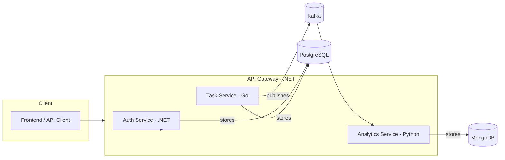

# Polyglot Microservices Platform

This project is a **showcase system** demonstrating modern software
architecture with a **polyglot stack**:\
- **.NET (C#)** → API Gateway & Authentication\
- **Go** → Task Service (high-performance event-driven service)\
- **Python** → Analytics Service (data processing, reporting)

It is designed to highlight skills in **distributed systems,
microservices, DevOps, and clean code**.

------------------------------------------------------------------------

## 🔹 Architecture



------------------------------------------------------------------------

## 🔹 Services

### API Gateway (.NET 8, YARP)

-   Routes requests to internal services\
-   Handles JWT authentication & rate limiting

### Auth Service (.NET 8)

-   User registration & authentication\
-   Issues JWT tokens\
-   Stores user data in PostgreSQL

### Task Service (Go)

-   Manages projects and tasks (CRUD)\
-   Publishes events (`task_created`, `task_updated`) to Kafka/NATS\
-   Stores data in PostgreSQL

### Analytics Service (Python, FastAPI)

-   Consumes events from Kafka/NATS\
-   Computes analytics (task counts, completion times, etc.)\
-   Stores results in MongoDB\
-   Exposes REST API for dashboards

------------------------------------------------------------------------

## 🔹 Infrastructure

-   **Databases**: PostgreSQL, MongoDB\
-   **Message Broker**: Kafka (or NATS for lighter setup)\
-   **Observability**: Prometheus, Grafana, Jaeger\
-   **Logging**: Loki (alternative to ELK for simplicity)\
-   **Containerization**: Docker & Kubernetes (K3s/Minikube for local
    dev)\
-   **CI/CD**: GitHub Actions

------------------------------------------------------------------------

## 🔹 Getting Started

### Prerequisites

-   Docker & Docker Compose\
-   .NET 8 SDK\
-   Go 1.22+\
-   Python 3.11+

### Run Locally (Docker Compose)

``` bash
docker compose up --build
```

### Kubernetes (Minikube)

``` bash
kubectl apply -f infra/k8s/
```

------------------------------------------------------------------------

## 🔹 Development

Each service lives in its own folder:

    polyglot-microservices/
    │── api-gateway/          # .NET API Gateway
    │── auth-service/         # .NET Auth Service
    │── task-service/         # Go Task Service
    │── analytics-service/    # Python Analytics
    │── infra/                # Docker Compose, K8s manifests
    │── docs/                 # Architecture diagrams, ADRs
    │── COPILOT_INSTRUCTIONS.md
    │── README.md

------------------------------------------------------------------------

## 🔹 Roadmap

-   [ ] Core services up and running with Docker Compose\
-   [ ] Event streaming with Kafka/NATS\
-   [ ] Analytics API powered by Python\
-   [ ] Observability (Prometheus, Grafana, Jaeger)\
-   [ ] CI/CD pipeline with GitHub Actions\
-   [ ] Deploy demo on Hetzner server

------------------------------------------------------------------------

## 🔹 License

MIT License --- feel free to fork, extend, and learn from this project.
