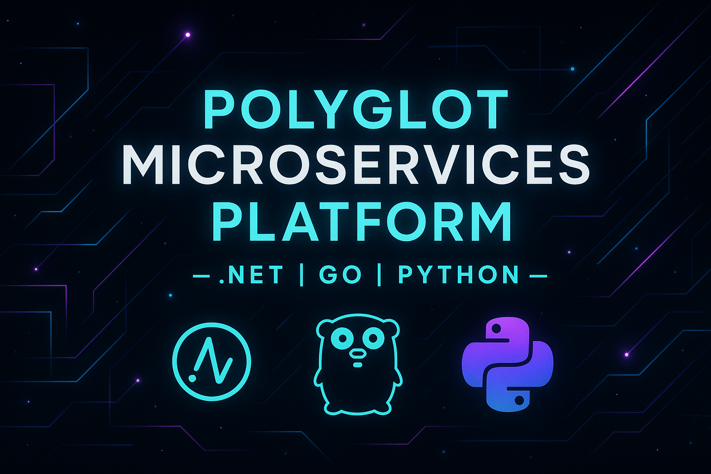
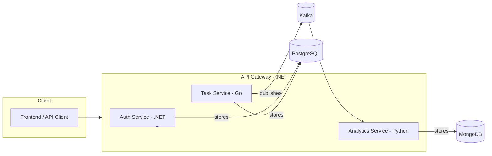

# Polyglot Microservices Platform

This project is a **showcase system** demonstrating modern software
architecture with a **polyglot stack**:\
- **.NET (C#)** → API Gateway & Authentication\
- **Go** → Task Service (high-performance event-driven service)\
- **Python** → Analytics Service (data processing, reporting)

It is designed to highlight skills in **distributed systems,
microservices, DevOps, and clean code**.

------------------------------------------------------------------------

## 🔹 Architecture



------------------------------------------------------------------------

## 🔹 Services

### API Gateway (.NET 9, YARP)

-   Routes requests to internal services
-   Handles JWT authentication & rate limiting

### Auth Service (.NET 9)

-   User registration & authentication
-   Issues JWT tokens
-   Stores user data in PostgreSQL

### Task Service (Go)

-   Manages projects and tasks (CRUD)
-   Publishes events (`task_created`, `task_updated`) to Kafka
-   Stores data in PostgreSQL

### Analytics Service (Python, FastAPI)

-   Consumes events from Kafka
-   Computes analytics (task counts, completion times, etc.)
-   Stores results in MongoDB
-   Exposes REST API for dashboards

------------------------------------------------------------------------

## 🔹 Infrastructure

-   **Databases**: PostgreSQL, MongoDB
-   **Message Broker**: Kafka
-   **Observability**: Prometheus, Grafana, Jaeger
-   **Logging**: Loki (alternative to ELK for simplicity)
-   **Containerization**: Docker
-   **CI/CD**: GitHub Actions

------------------------------------------------------------------------

## 🔹 Getting Started

### Prerequisites

-   Docker & Docker Compose\
-   .NET 9 SDK\
-   Go 1.22+\
-   Python 3.11+

### Run Locally (Docker Compose)

``` bash
docker compose up --build
```

------------------------------------------------------------------------

## 🔹 Development

Each service lives in its own folder:

    polyglot-microservices/
    │── api-gateway/          # .NET API Gateway
    │── auth-service/         # .NET Auth Service
    │── task-service/         # Go Task Service
    │── analytics-service/    # Python Analytics API
    │── analytics-worker/     # Python Analytics Kafka consumer / worker
    │── docs/                 # Architecture diagrams, ADRs
    │── COPILOT_INSTRUCTIONS.md
    │── README.md             # TODO Add rest of files :)


------------------------------------------------------------------------

## 🔹 License

ToDo :D
